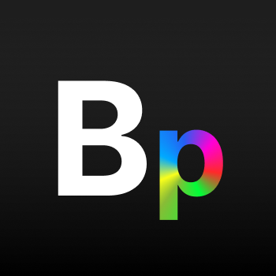
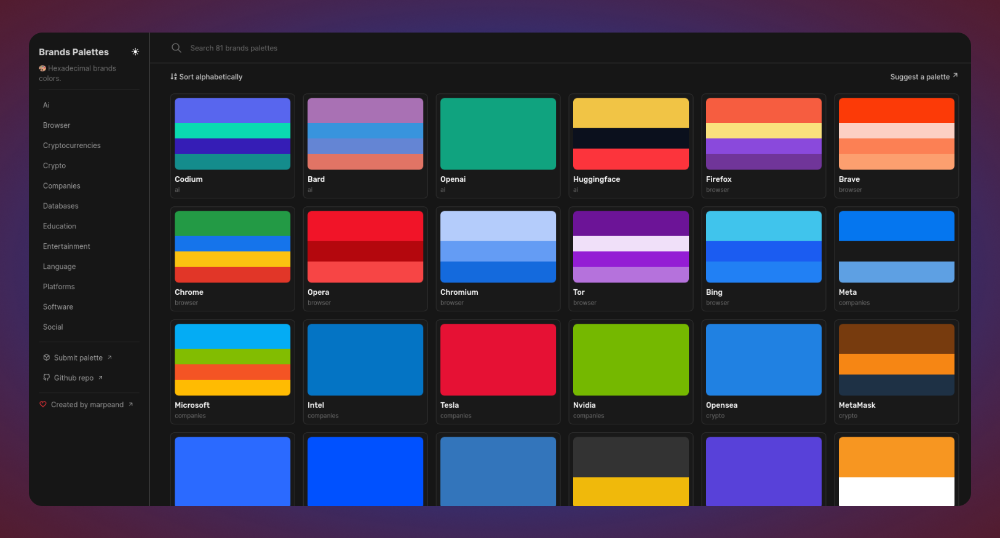

<h1 align="center">
  <br>
  <a href="http://www.amitmerchant.com/electron-markdownify"></a>
  <br>
  <br>
  Brands Palettes
  <br>
</h1>

<h4 align="center">🎨 List of hexadecimal brands colors. <br>
<a href="https://brands-palettes.vercel.app">brands-palettes.vercel.app</a></h4>

<p align="center">
  <a href="https://brands-palettes.vercel.app" target="_blank">Discover</a> •
  <a href="#getting-started">Submit Palette</a> •
  <a href="#license">License</a> 
</p>



# Brands Palettes

Brands Palettes is a collection of hexadecimal brand colors, providing an extensive list of colors associated with various brands.
I based this project and code on [svgl](https://github.com/pheralb/svgl) made by [pheralb](https://github.com/pheralb)

## Getting Started

1. Fork this project and then clone it

```bash
$ git clone https://github.com/<your_username>/brands-palettes
```

2. Install dependencies and run the app

```bash
$ pnpm install

$ npm run dev
```

3. Open [**`app/data/brands.ts`**](data/brands.ts) and find the category of your brand, if it's not available, [open an issue](https://github.com/marpeand/brands-palettes/issues/new) proposing it. If you prefer create a Pull Request adding it.

> [!WARNING]
>
> - Ensure all colors are in `hexadecimal` format, beginning with `#`.
> - For an optimal visual experience, limit each brand to a maximum of **four** colors. While additional colors are accepted, keep in mind that it might affect the appearance on the BrandCard.

4. Add or Edit Brand Colors:

   Open [**`app/data/brands.ts`**]() and find the category of your brand. If it's not available, [open an issue](https://github.com/marpeand/brands-palettes/issues/new) proposing it or create a Pull Request.

   Follow the structure:

   ```js
   brand: ['#color1', '#color2', '#color3', ...],
   ```

   For example:

   ```js
   cryptocurrencies: {
    bitcoin: ['#F79621', '#FFFFFF'],
    ethereum: ['#637BEC', '#DADEF2', '#8494EC', '#A4B4F4'],
   }
   ```

> [!NOTE]
>
> - If you need to extract the palette from any brand logo, consider using this [Canva Tool](https://www.canva.com/colors/color-palette-generator/).

# License

By contributing to the project, you agree to license your contributions under the same license as the project itself. See the [LICENSE](LICENSE) file for more information.
